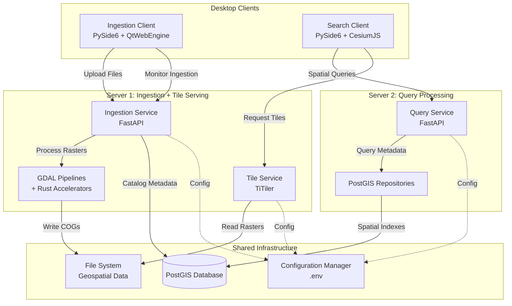
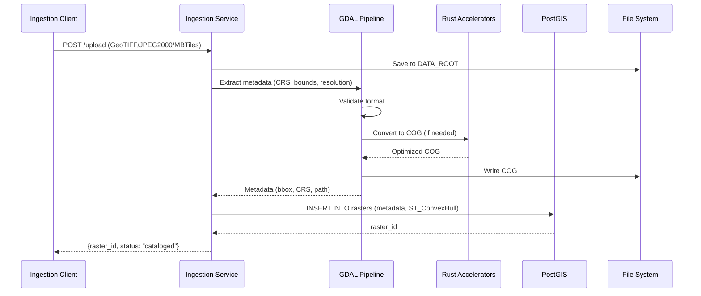
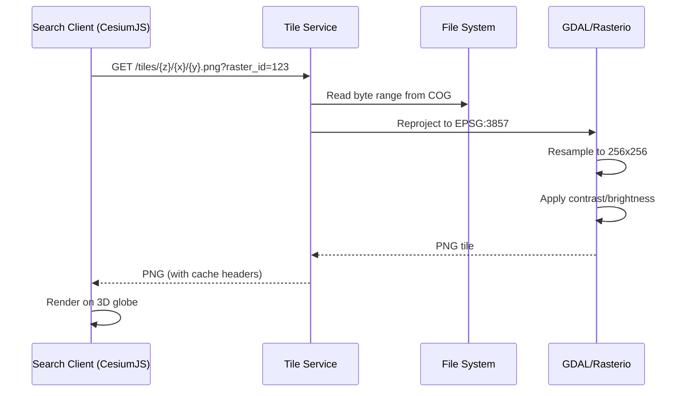
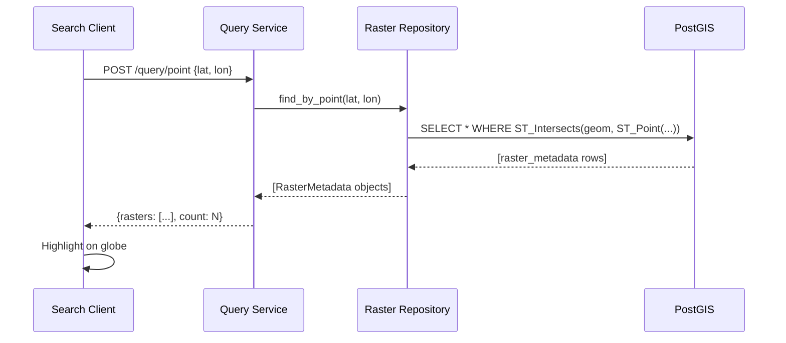

# Design Document: Geospatial Microservices Refactoring

## Overview

### Purpose

This design document specifies the technical architecture for refactoring an existing monolithic offline 3D GIS desktop application into a modular, microservices-style architecture. The refactoring creates a new `src_new/` directory structure organized by deployment boundaries and single-responsibility principles, enabling independent deployment of ingestion processing, tile serving, and search/query components across a secure air-gapped government LAN.

### System Context

The existing system (`src/`) is a working offline 3D geospatial application that:
- Processes terabyte-scale geospatial data (2-3cm resolution aerial imagery, 1-2m DEMs)
- Supports GeoTIFF, JPEG2000, and MBTiles formats
- Provides desktop clients for data ingestion and 3D visualization
- Uses PostGIS for spatial indexing and TiTiler for dynamic tile serving
- Embeds CesiumJS in PySide6 via QtWebEngine for 3D globe rendering

The refactored system must maintain **full backward compatibility** while reorganizing code for:
- **Two-server deployment**: Server 1 (Ingestion + Tile Service), Server 2 (Query Service)
- **Modular architecture**: Single-responsibility modules with clear boundaries
- **Centralized configuration**: .env-based configuration management
- **Performance optimization**: Rust integration for CPU-intensive operations
- **Security**: Air-gapped LAN with IP-based access control

### Goals and Non-Goals

**Goals:**
- Preserve all existing functionality without rewriting business logic
- Create deployment-boundary-aligned module structure in `src_new/`
- Split large monolithic files (bridge.js, controller.py) into focused modules
- Centralize configuration in .env files
- Enable independent deployment of services across two servers
- Eliminate dead code and consolidate duplicates
- Maintain full backward compatibility with existing working codebase

**Non-Goals:**
- Rewriting core algorithms or business logic
- Adding new features beyond refactoring scope
- Changing data formats or database schemas
- Modifying external API contracts
- Cloud deployment or internet connectivity

### Key Design Decisions

1. **Preserve-and-Reorganize Strategy**: All working code from `src/` is preserved; refactoring focuses on file organization, not logic rewriting
2. **Deployment-Driven Structure**: `src_new/` organized by deployment targets (services, clients, shared)
3. **Configuration Externalization**: All hardcoded paths, URLs, and constants moved to .env
4. **Repository Pattern**: PostGIS queries abstracted into repository layer
5. **Rust for Performance**: PyO3-based Rust modules for CPU-bound geospatial operations
6. **QWebChannel Bridge**: Bidirectional Python-JavaScript communication for desktop clients
7. **TiTiler Dynamic Serving**: On-demand tile generation instead of pre-rendered tile pyramids


## Architecture

### High-Level Architecture

The refactored system follows a microservices-inspired architecture adapted for LAN deployment:



### Component Interactions

#### Data Ingestion Flow



#### Tile Serving Flow



#### Spatial Query Flow



### Deployment Architecture

#### Server 1: Ingestion + Tile Serving

**Purpose**: Handle data upload, processing, and tile generation

**Components**:
- Ingestion Service (FastAPI on port 8001)
- Tile Service (TiTiler on port 8002)
- GDAL processing pipelines
- Rust accelerators (rasterize, coordinate transformation)

**Hardware Requirements**:
- High CPU for GDAL processing
- Large disk for DATA_ROOT storage
- 32GB+ RAM for processing large rasters

**Startup**: `deploy_server1.sh` launches both services

#### Server 2: Query Processing

**Purpose**: Handle spatial searches and metadata queries

**Components**:
- Query Service (FastAPI on port 8003)
- PostGIS repository layer
- Spatial indexing logic

**Hardware Requirements**:
- Moderate CPU for query processing
- Database connection to PostGIS
- 16GB+ RAM

**Startup**: `deploy_server2.sh` launches query service

#### Desktop Clients

**Ingestion Client**:
- Runs on data manager workstations
- Communicates with Server 1 only
- PySide6 UI for file upload and monitoring

**Search Client**:
- Runs on analyst workstations
- Communicates with Server 2 (queries) and Server 1 (tiles)
- PySide6 + QtWebEngine + CesiumJS for 3D visualization

### Technology Stack

| Layer | Technology | Purpose |
|-------|-----------|---------|
| **Backend Services** | Python 3.10+, FastAPI, Uvicorn | REST API services |
| **Geospatial Processing** | GDAL 3.6+, Rasterio, PyProj | Raster I/O, CRS transformation |
| **Database** | PostgreSQL 14+, PostGIS 3.3+ | Spatial indexing and queries |
| **Tile Serving** | TiTiler 0.15+ | Dynamic tile generation |
| **Desktop Framework** | PySide6 (Qt 6.5+), QtWebEngine | Native desktop UI |
| **3D Rendering** | CesiumJS 1.110+ (offline) | WebGL-based 3D globe |
| **Python-JS Bridge** | QWebChannel | Bidirectional communication |
| **Performance** | Rust 1.70+, PyO3, rusterize | CPU-intensive operations |
| **Configuration** | python-dotenv | .env file management |
| **Testing** | pytest, pytest-asyncio | Unit and integration tests |
| **Packaging** | conda, conda-pack | Offline environment distribution |


## Components and Interfaces

### Directory Structure: src_new/

```
src_new/
├── services/                      # Backend microservices
│   ├── ingestion/                # Server 1: Data ingestion
│   │   ├── api/
│   │   │   ├── __init__.py
│   │   │   ├── routes.py         # FastAPI endpoints
│   │   │   └── dependencies.py   # DI for config, DB
│   │   ├── gdal_pipelines/
│   │   │   ├── __init__.py
│   │   │   ├── metadata_extractor.py
│   │   │   ├── cog_converter.py
│   │   │   ├── reprojector.py
│   │   │   └── thumbnail_generator.py
│   │   ├── format_handlers/
│   │   │   ├── __init__.py
│   │   │   ├── geotiff_handler.py
│   │   │   ├── jpeg2000_handler.py
│   │   │   └── mbtiles_handler.py
│   │   ├── rust_accelerators/
│   │   │   ├── __init__.py       # Python wrappers
│   │   │   ├── rasterize.rs      # Rust source
│   │   │   ├── transform.rs
│   │   │   └── Cargo.toml
│   │   ├── __init__.py
│   │   └── service.py            # FastAPI app
│   │
│   ├── tile_serving/             # Server 1: Tile generation
│   │   ├── __init__.py
│   │   ├── titiler_config.py     # TiTiler setup
│   │   ├── tile_endpoints.py     # Custom routes
│   │   ├── cache_manager.py      # Tile caching
│   │   └── service.py            # FastAPI app
│   │
│   └── query/                    # Server 2: Spatial queries
│       ├── api/
│       │   ├── __init__.py
│       │   ├── routes.py
│       │   └── dependencies.py
│       ├── repositories/
│       │   ├── __init__.py
│       │   ├── raster_repository.py
│       │   └── spatial_index_repository.py
│       ├── __init__.py
│       ├── spatial_queries.py    # Business logic
│       └── service.py            # FastAPI app
│
├── clients/                      # Desktop applications
│   ├── desktop_ingestion/        # Data manager client
│   │   ├── ui/
│   │   │   ├── __init__.py
│   │   │   ├── main_window.py
│   │   │   ├── upload_dialog.py
│   │   │   └── monitoring_panel.py
│   │   ├── __init__.py
│   │   ├── api_client.py         # HTTP client for Ingestion Service
│   │   └── main.py               # Entry point
│   │
│   └── desktop_search/           # Analyst client
│       ├── ui/
│       │   ├── __init__.py
│       │   ├── main_window.py
│       │   ├── search_panel.py
│       │   └── controls_panel.py
│       ├── bridge/               # QWebChannel communication
│       │   ├── __init__.py
│       │   ├── channel_setup.py
│       │   └── signal_handlers.py
│       ├── cesium/               # CesiumJS integration
│       │   ├── viewer_init.js
│       │   ├── camera_control.js
│       │   ├── layer_manager.js
│       │   └── event_handlers.js
│       ├── web_assets/
│       │   ├── index.html
│       │   ├── vendor/           # Offline CesiumJS
│       │   └── styles/
│       ├── __init__.py
│       ├── api_client.py         # HTTP client for Query/Tile Services
│       └── main.py               # Entry point
│
├── shared/                       # Common utilities
│   ├── models/
│   │   ├── __init__.py
│   │   ├── raster_metadata.py    # Pydantic models
│   │   ├── bounding_box.py
│   │   ├── crs.py
│   │   ├── tile_request.py
│   │   └── query_result.py
│   ├── utils/
│   │   ├── __init__.py
│   │   ├── coordinate_conversion.py
│   │   ├── file_validation.py
│   │   ├── logging_config.py
│   │   └── error_handlers.py
│   ├── auth/
│   │   ├── __init__.py
│   │   └── lan_security.py       # IP-based access control
│   ├── ui_components/            # Shared PySide6 widgets
│   │   ├── __init__.py
│   │   ├── login_dialog.py
│   │   ├── settings_dialog.py
│   │   └── about_dialog.py
│   ├── __init__.py
│   ├── constants.py              # System-wide constants
│   └── config.py                 # Configuration manager
│
├── scripts/                      # Deployment and utilities
│   ├── start_ingestion_service.sh
│   ├── start_tile_service.sh
│   ├── start_query_service.sh
│   ├── start_ingestion_client.sh
│   ├── start_search_client.sh
│   ├── deploy_server1.sh
│   ├── deploy_server2.sh
│   ├── build_rust.sh
│   └── setup_environment.sh
│
├── tests/                        # Test suite
│   ├── unit/
│   │   ├── test_models.py
│   │   ├── test_repositories.py
│   │   └── test_utils.py
│   ├── integration/
│   │   ├── test_ingestion_api.py
│   │   ├── test_query_api.py
│   │   └── test_tile_api.py
│   ├── e2e/
│   │   └── test_full_workflow.py
│   ├── data/                     # Sample test files
│   │   ├── sample.tif
│   │   └── sample.j2k
│   └── conftest.py               # pytest fixtures
│
├── docs/                         # Documentation
│   ├── ARCHITECTURE.md
│   ├── MIGRATION_GUIDE.md
│   ├── API_REFERENCE.md
│   ├── CONFIGURATION.md
│   └── DEPLOYMENT.md
│
├── .env.example                  # Configuration template
├── environment.yml               # Conda environment
├── requirements.txt              # Pip dependencies
├── pyproject.toml                # Package metadata
└── README.md
```

### Module Decomposition Strategy

#### Large File Splitting: bridge.js → cesium/

**Original**: `src/client_desktop/frontend/bridge.js` (~800 lines)

**Refactored**:
```
src_new/clients/desktop_search/cesium/
├── viewer_init.js          # Cesium.Viewer instantiation, offline config
├── camera_control.js       # flyTo, camera manipulation, animations
├── layer_manager.js        # ImageryLayer management, add/remove
├── event_handlers.js       # Mouse clicks, measurements, annotations
└── index.js                # Re-exports all modules
```

**API Preservation**:
```javascript
// index.js - maintains original public API
export { initializeViewer } from './viewer_init.js';
export { flyToLocation, setCameraOrientation } from './camera_control.js';
export { addImageryLayer, removeLayer } from './layer_manager.js';
export { enableMeasurement, addMarker } from './event_handlers.js';
```

#### Large File Splitting: controller.py → services/

**Original**: `src/desktop_client/client_backend/controller.py` (~1200 lines)

**Refactored**:
```
src_new/services/query/
├── api/routes.py               # FastAPI route handlers
├── spatial_queries.py          # Business logic (bbox, point queries)
└── repositories/
    ├── raster_repository.py    # Database access layer
    └── spatial_index_repository.py
```

**API Preservation**:
```python
# routes.py - maintains original endpoint signatures
@router.post("/query/point")
async def query_by_point(request: PointQueryRequest) -> QueryResult:
    """Original API signature preserved"""
    return await spatial_queries.find_by_point(request.lat, request.lon)
```

### Service Interfaces

#### Ingestion Service API

**Base URL**: `http://{INGESTION_SERVICE_HOST}:{INGESTION_SERVICE_PORT}`

```python
# POST /upload
class UploadRequest:
    file: UploadFile
    metadata: Optional[Dict[str, Any]]

class UploadResponse:
    raster_id: str
    status: Literal["processing", "cataloged", "failed"]
    message: str
    bbox: Optional[BoundingBox]

# GET /status/{raster_id}
class IngestionStatus:
    raster_id: str
    status: str
    progress: float  # 0.0 to 1.0
    error: Optional[str]

# GET /health
class HealthResponse:
    status: Literal["healthy", "degraded", "unhealthy"]
    database: bool
    disk_space_gb: float
```

#### Tile Service API

**Base URL**: `http://{TILE_SERVICE_HOST}:{TILE_SERVICE_PORT}`

```python
# GET /tiles/{z}/{x}/{y}.png
# Query params: raster_id, contrast, brightness, colormap

# GET /preview/{raster_id}
# Returns 512x512 thumbnail

# GET /metadata/{raster_id}
class TileMetadata:
    bounds: BoundingBox
    minzoom: int
    maxzoom: int
    center: Tuple[float, float]

# GET /health
```

#### Query Service API

**Base URL**: `http://{QUERY_SERVICE_HOST}:{QUERY_SERVICE_PORT}`

```python
# POST /query/point
class PointQueryRequest:
    lat: float
    lon: float
    crs: str = "EPSG:4326"

class QueryResult:
    rasters: List[RasterMetadata]
    count: int

# POST /query/bbox
class BBoxQueryRequest:
    min_lon: float
    min_lat: float
    max_lon: float
    max_lat: float
    crs: str = "EPSG:4326"

# GET /raster/{raster_id}
class RasterMetadata:
    raster_id: str
    file_path: str
    crs: str
    resolution: float
    bbox: BoundingBox
    upload_date: datetime

# GET /health
```

### QWebChannel Communication Protocol

**Python Side** (signal_handlers.py):
```python
class BridgeSignals(QObject):
    # Python → JavaScript
    fly_to_location = Signal(float, float, float)  # lat, lon, height
    add_imagery_layer = Signal(str, str)  # layer_id, tile_url
    update_contrast = Signal(str, float)  # layer_id, contrast
    
    # JavaScript → Python (slots)
    @Slot(float, float)
    def on_map_click(self, lat: float, lon: float):
        """Handle click events from CesiumJS"""
        pass
    
    @Slot(str, result=str)
    def query_elevation(self, coords_json: str) -> str:
        """Extract DEM elevation profile"""
        pass
```

**JavaScript Side** (event_handlers.js):
```javascript
// Receive signals from Python
window.bridge.fly_to_location.connect((lat, lon, height) => {
    viewer.camera.flyTo({
        destination: Cesium.Cartesian3.fromDegrees(lon, lat, height)
    });
});

// Send events to Python
viewer.screenSpaceEventHandler.setInputAction((click) => {
    const cartesian = viewer.scene.pickPosition(click.position);
    const cartographic = Cesium.Cartographic.fromCartesian(cartesian);
    const lat = Cesium.Math.toDegrees(cartographic.latitude);
    const lon = Cesium.Math.toDegrees(cartographic.longitude);
    window.bridge.on_map_click(lat, lon);
}, Cesium.ScreenSpaceEventType.LEFT_CLICK);
```

