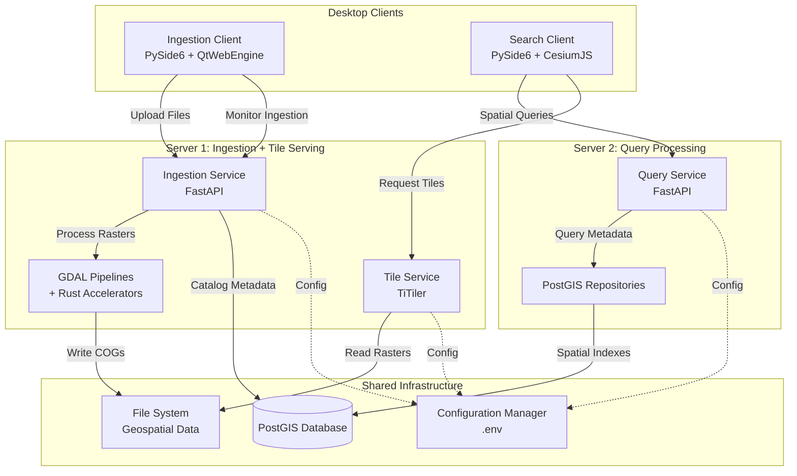
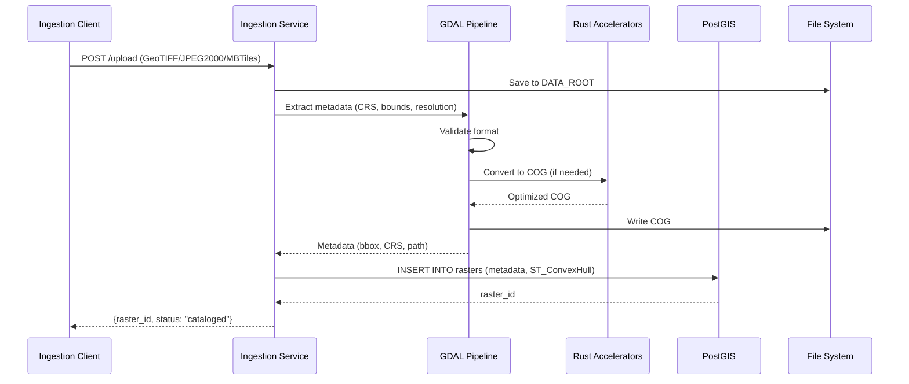
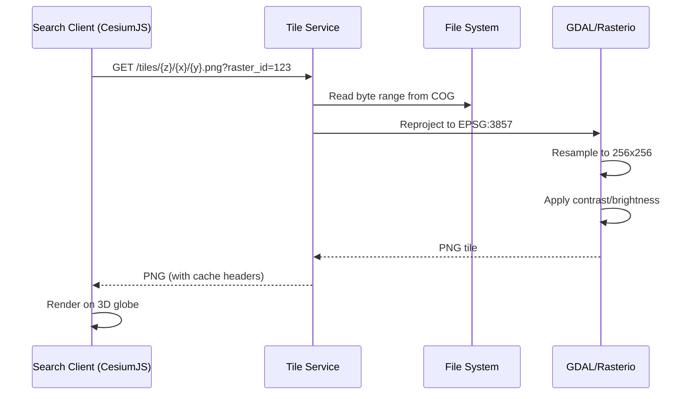
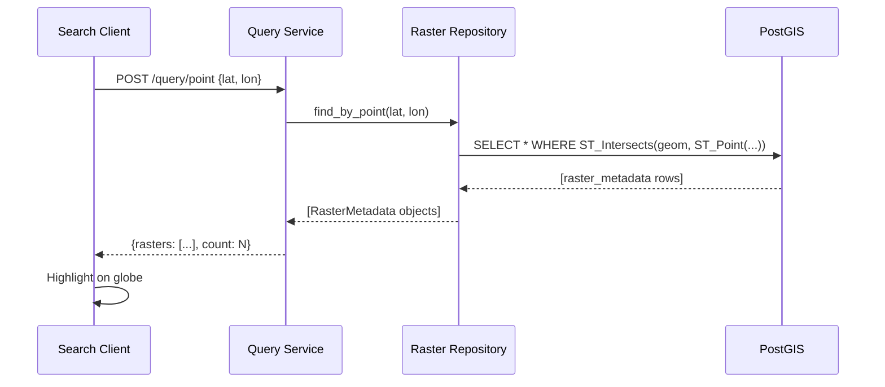

# Architecture Documentation: Geospatial Microservices Refactoring

## Overview

This document describes the architecture of the refactored geospatial microservices system (`src_new/`). The system transforms a monolithic offline 3D GIS desktop application into a modular, microservices-style architecture optimized for two-server deployment in an air-gapped government LAN environment.

## System Architecture

### High-Level Architecture

The system follows a microservices-inspired architecture adapted for LAN deployment:



### Deployment Architecture

#### Server 1: Ingestion + Tile Serving

**Purpose**: Handle data upload, processing, and tile generation

**Components**:
- **Ingestion Service** (FastAPI on port 8001)
  - Accepts multipart file uploads (GeoTIFF, JPEG2000, MBTiles)
  - Validates file formats
  - Extracts metadata using GDAL/Rasterio
  - Catalogs rasters in PostGIS
  
- **Tile Service** (TiTiler on port 8002)
  - Serves dynamic XYZ map tiles
  - Generates preview thumbnails
  - Provides raster metadata
  - Supports real-time image manipulation (contrast, brightness, colormap)

- **GDAL Processing Pipelines**
  - Metadata extraction
  - COG (Cloud-Optimized GeoTIFF) conversion
  - CRS reprojection
  - Thumbnail generation

- **Rust Accelerators** (optional)
  - Vector rasterization (rusterize)
  - Batch coordinate transformation
  - Falls back to Python if unavailable

**Hardware Requirements**:
- High CPU for GDAL processing
- Large disk for DATA_ROOT storage (terabyte-scale)
- 32GB+ RAM for processing large rasters
- Fast SSD recommended for tile serving

**Startup**: `bash src_new/scripts/deploy_server1.sh`

#### Server 2: Query Processing

**Purpose**: Handle spatial searches and metadata queries

**Components**:
- **Query Service** (FastAPI on port 8003)
  - Point-based spatial queries
  - Bounding box queries
  - Raster metadata retrieval
  - Health monitoring

- **PostGIS Repository Layer**
  - Parameterized SQL queries (SQL injection prevention)
  - Spatial indexing (GiST indexes)
  - Typed data models (Pydantic)

**Hardware Requirements**:
- Moderate CPU for query processing
- Database connection to PostGIS
- 16GB+ RAM
- SSD recommended for database performance

**Startup**: `bash src_new/scripts/deploy_server2.sh`

#### Desktop Clients

**Ingestion Client** (`src_new/clients/desktop_ingestion/`)
- Runs on data manager workstations
- Communicates with Server 1 only
- PySide6 UI for file upload and monitoring
- Features:
  - Batch file upload
  - Ingestion progress monitoring
  - Status tracking
  - Error reporting

**Search Client** (`src_new/clients/desktop_search/`)
- Runs on analyst workstations
- Communicates with Server 2 (queries) and Server 1 (tiles)
- PySide6 + QtWebEngine + CesiumJS for 3D visualization
- Features:
  - 3D globe rendering (offline CesiumJS)
  - Point and bounding box queries
  - Layer management
  - Camera controls
  - Measurement tools
  - Annotations

## Directory Structure

```
src_new/
├── services/                      # Backend microservices
│   ├── ingestion/                # Server 1: Data ingestion
│   │   ├── api/                  # FastAPI routes and dependencies
│   │   ├── gdal_pipelines/       # GDAL processing modules
│   │   ├── format_handlers/      # Format-specific validators
│   │   ├── rust_accelerators/    # PyO3 Rust modules
│   │   └── service.py            # FastAPI app entry point
│   │
│   ├── tile_serving/             # Server 1: Tile generation
│   │   ├── titiler_config.py     # TiTiler setup
│   │   ├── tile_endpoints.py     # Custom routes
│   │   └── service.py            # FastAPI app entry point
│   │
│   └── query/                    # Server 2: Spatial queries
│       ├── api/                  # FastAPI routes and dependencies
│       ├── repositories/         # PostGIS data access layer
│       └── service.py            # FastAPI app entry point
│
├── clients/                      # Desktop applications
│   ├── desktop_ingestion/        # Data manager client
│   │   ├── ui/                   # PySide6 UI modules
│   │   ├── api_client.py         # HTTP client
│   │   └── main.py               # Entry point
│   │
│   └── desktop_search/           # Analyst client
│       ├── ui/                   # PySide6 UI modules
│       ├── bridge/               # QWebChannel communication
│       ├── cesium/               # CesiumJS integration
│       ├── web_assets/           # HTML, CSS, offline CesiumJS
│       ├── api_client.py         # HTTP client
│       └── main.py               # Entry point
│
├── shared/                       # Common utilities
│   ├── models/                   # Pydantic data models
│   ├── utils/                    # Utility functions
│   ├── auth/                     # LAN security
│   ├── ui_components/            # Shared PySide6 widgets
│   ├── constants.py              # System-wide constants
│   └── config.py                 # Configuration manager
│
├── scripts/                      # Deployment and utilities
├── tests/                        # Test suite
└── docs/                         # Documentation
```

## Module Responsibilities

### Services Layer

#### Ingestion Service (`services/ingestion/`)
- **Responsibility**: Accept, validate, process, and catalog geospatial raster files
- **Key Modules**:
  - `api/routes.py`: REST endpoints (`/upload`, `/status/{raster_id}`, `/health`)
  - `gdal_pipelines/metadata_extractor.py`: Extract CRS, bounds, resolution
  - `gdal_pipelines/cog_converter.py`: Convert to Cloud-Optimized GeoTIFF
  - `format_handlers/`: Format-specific validation (GeoTIFF, JPEG2000, MBTiles)
  - `rust_accelerators/`: Optional Rust modules for performance
- **Dependencies**: GDAL, Rasterio, PostGIS, FastAPI
- **Deployment**: Server 1

#### Tile Service (`services/tile_serving/`)
- **Responsibility**: Serve dynamic map tiles from cataloged rasters
- **Key Modules**:
  - `titiler_config.py`: TiTiler FastAPI app configuration
  - `tile_endpoints.py`: Custom routes (`/tiles/{z}/{x}/{y}.png`, `/preview/{raster_id}`, `/metadata/{raster_id}`)
- **Dependencies**: TiTiler, GDAL, Rasterio, FastAPI
- **Deployment**: Server 1

#### Query Service (`services/query/`)
- **Responsibility**: Provide spatial search and metadata retrieval
- **Key Modules**:
  - `api/routes.py`: REST endpoints (`/query/point`, `/query/bbox`, `/raster/{raster_id}`, `/health`)
  - `repositories/raster_repository.py`: PostGIS data access layer
  - `repositories/spatial_index_repository.py`: Spatial indexing operations
- **Dependencies**: PostGIS, SQLAlchemy, FastAPI
- **Deployment**: Server 2

### Clients Layer

#### Desktop Ingestion Client (`clients/desktop_ingestion/`)
- **Responsibility**: Provide UI for data managers to upload and monitor ingestion
- **Key Modules**:
  - `ui/main_window.py`: Main application window
  - `ui/upload_dialog.py`: File selection and upload
  - `ui/monitoring_panel.py`: Ingestion progress tracking
  - `api_client.py`: HTTP client for Ingestion Service
- **Dependencies**: PySide6, httpx
- **Deployment**: Data manager workstations

#### Desktop Search Client (`clients/desktop_search/`)
- **Responsibility**: Provide 3D visualization and spatial query UI for analysts
- **Key Modules**:
  - `main_window.py`: Main application window with embedded web view
  - `control_panel.py`: Layer controls, contrast/brightness sliders
  - `bridge.py`: QWebChannel initialization and Python-JavaScript communication
  - `cesium/viewer_init.js`: Offline Cesium viewer setup
  - `cesium/camera_control.js`: Camera manipulation
  - `cesium/layer_manager.js`: Imagery layer management
  - `cesium/event_handlers.js`: Mouse events, measurements
  - `api_client.py`: HTTP client for Query and Tile Services
- **Dependencies**: PySide6, QtWebEngine, CesiumJS (offline), httpx
- **Deployment**: Analyst workstations

### Shared Layer

#### Models (`shared/models/`)
- **Responsibility**: Define typed data structures used across all services
- **Key Modules**:
  - `raster_metadata.py`: RasterMetadata Pydantic model
  - `bounding_box.py`: BoundingBox with validation
  - `crs.py`: CoordinateReferenceSystem
  - `tile_request.py`: TileRequest parameters
  - `query_result.py`: QueryResult with rasters list

#### Utilities (`shared/utils/`)
- **Responsibility**: Provide common utility functions
- **Key Modules**:
  - `coordinate_conversion.py`: CRS transformation helpers
  - `file_validation.py`: File format validators
  - `logging_config.py`: Structured logging setup
  - `error_handlers.py`: FastAPI exception handlers

#### Authentication (`shared/auth/`)
- **Responsibility**: Enforce LAN security policies
- **Key Modules**:
  - `lan_security.py`: IP-based access control middleware

#### Configuration (`shared/config.py`)
- **Responsibility**: Centralized .env-based configuration
- **Key Features**:
  - Environment variable loading
  - Type validation
  - Default values
  - GDAL environment variable application

## Component Interaction Diagrams

### Data Ingestion Flow



### Tile Serving Flow



### Spatial Query Flow



## Technology Stack

| Layer | Technology | Purpose |
|-------|-----------|---------|
| **Backend Services** | Python 3.10+, FastAPI, Uvicorn | REST API services |
| **Geospatial Processing** | GDAL 3.6+, Rasterio, PyProj | Raster I/O, CRS transformation |
| **Database** | PostgreSQL 14+, PostGIS 3.3+ | Spatial indexing and queries |
| **Tile Serving** | TiTiler 0.15+ | Dynamic tile generation |
| **Desktop Framework** | PySide6 (Qt 6.5+), QtWebEngine | Native desktop UI |
| **3D Rendering** | CesiumJS 1.110+ (offline) | WebGL-based 3D globe |
| **Python-JS Bridge** | QWebChannel | Bidirectional communication |
| **Performance** | Rust 1.70+, PyO3, rusterize | CPU-intensive operations |
| **Configuration** | python-dotenv | .env file management |
| **Testing** | pytest, pytest-asyncio | Unit and integration tests |
| **Packaging** | conda, conda-pack | Offline environment distribution |

## Security Architecture

### LAN Security

- **IP-based Access Control**: All services enforce ALLOWED_HOSTS whitelist
- **No External Requests**: CesiumJS and TiTiler configured for offline operation
- **Bind to LAN Interface**: Services bind to LAN IP, not 0.0.0.0 (unless BIND_ALL_INTERFACES=true)
- **Credential Masking**: Database credentials masked in logs

### Air-Gap Compliance

- **No Internet Dependencies**: All assets vendored locally
- **Offline CesiumJS**: Complete CesiumJS distribution in `web_assets/vendor/`
- **No Cesium Ion**: Cesium Ion, Bing Maps, and terrain providers disabled
- **No Remote Rasters**: TiTiler configured to reject external HTTP requests

## Performance Considerations

### Tile Caching

- **LRU Cache**: Configurable via TILE_CACHE_SIZE environment variable
- **Cache Invalidation**: Automatic on raster updates
- **Cache Headers**: Proper HTTP cache headers for client-side caching

### GDAL Optimization

- **Environment Variables**:
  - `GDAL_DISABLE_READDIR_ON_OPEN=EMPTY_DIR`: Prevent directory scanning
  - `GDAL_HTTP_MERGE_CONSECUTIVE_RANGES=YES`: Optimize range requests
- **COG Format**: Cloud-Optimized GeoTIFF for efficient tile serving
- **Overviews**: Pre-computed overviews for multi-resolution access

### Rust Accelerators

- **Vector Rasterization**: 10-100x speedup for large vector datasets
- **Coordinate Transformation**: Batch processing with GIL release
- **Graceful Fallback**: Pure Python fallback if Rust unavailable

## Logging and Monitoring

### Structured Logging

- **Format**: JSON or text (configurable via LOG_FORMAT)
- **Levels**: DEBUG, INFO, WARNING, ERROR, CRITICAL
- **Rotation**: Configurable max size and backup count
- **Output**: stdout and/or file (LOG_OUTPUT_PATH)

### Logged Events

- **Service Lifecycle**: Startup, shutdown
- **HTTP Requests**: Method, path, status code, duration
- **GDAL Operations**: File path, operation type, duration
- **Database Queries**: Query type, parameters, result count, duration
- **Errors**: Full stack traces with context

### Health Endpoints

All services expose `/health` endpoints:
- **Ingestion Service**: Database connectivity, disk space
- **Tile Service**: Service status, cache statistics
- **Query Service**: Database connectivity, query performance

## Migration from src/ to src_new/

### Key Differences

1. **Modular Structure**: Single-responsibility modules vs. monolithic files
2. **Deployment Boundaries**: Clear separation between Server 1 and Server 2
3. **Centralized Configuration**: .env-based vs. hardcoded values
4. **Repository Pattern**: Data access layer vs. inline SQL
5. **Typed Models**: Pydantic models vs. raw dictionaries
6. **Structured Logging**: JSON logging vs. print statements

### Backward Compatibility

- **API Signatures**: All public endpoints maintain original signatures
- **Data Formats**: Database schema unchanged
- **File Formats**: Same supported formats (GeoTIFF, JPEG2000, MBTiles)
- **Tile URLs**: Compatible with existing tile URL patterns

## Future Enhancements

### Potential Improvements

1. **Async Database Access**: Migrate to asyncpg for better concurrency
2. **Message Queue**: Add Celery/RabbitMQ for background processing
3. **Distributed Caching**: Redis for shared tile cache across instances
4. **Vector Tiles**: Add vector tile support (MVT format)
5. **3D Tiles**: Support for 3D Tiles (3D buildings, point clouds)
6. **Authentication**: Add user authentication and authorization
7. **Audit Logging**: Track user actions for compliance
8. **Metrics**: Prometheus metrics for monitoring
9. **Load Balancing**: Multiple tile service instances behind load balancer
10. **Database Replication**: PostGIS read replicas for query scaling

## References

- [TiTiler Documentation](https://developmentseed.org/titiler/)
- [CesiumJS Documentation](https://cesium.com/docs/)
- [PostGIS Documentation](https://postgis.net/documentation/)
- [GDAL Documentation](https://gdal.org/)
- [FastAPI Documentation](https://fastapi.tiangolo.com/)
- [PySide6 Documentation](https://doc.qt.io/qtforpython/)
